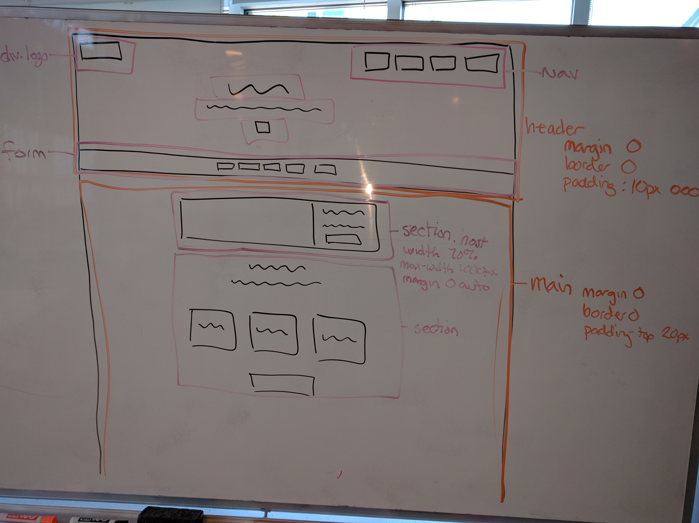

[Table of Contents](/README.md)

# Day 03 - CSS pseudo selectors, CSS positioning, Pixel Perfect, Keyboard Shortcuts

## Review
- Git
- Length units
  - px
  - em - standard unit based on text size
  - rem - like ems but based on the html font size instead of the current element
  - vh vw - like percent of height and width but based on viewport rather than element
  - % - percent of an element
- Pseudo elements
  - child html elements created using only css
  - ::before ::after
  - require a `content` property, even if it is only set to `''`
  - we used for the clearfix hack (to help parents find their floated children)
  - mostly used for adding style element to a page such as a triangle pointing at some content
- Triangles

## Challenge
Get in pairs and work together to build an HTML tree for the AirBnB website. Be prepared to justify why you structured your HTML as you did.

## Notes
### css positioning
- default is `position: static`
- other values are absolute, relative, fixed, ~sticky

#### fixed
  - fixed to the viewport of the page
  - removed an element from the flow of the page
  - top, right, bottom, left move the elements corresponding edge from the viewports corresponding edge
  - element will be sized based on its content unless height and width are specified OR if both top and bottom (or left and right) are specified

#### relative
  - stays in the flow of the page, taking up space where it would normally live
  - top right bottom left move the element's corresponding edge away from its original position's corresponding edge
  - if both left and right are specified, left will win. top wins the top bottom battle

#### fixed
  - removed from the flow of the page
  - element will be sized based on its content unless height and width are specified OR if both top and bottom (or left and right) are specified
  - top right bottom left move the element's corresponding edge from its **nearest non-statically positioned parent's** (or the viewport) corresponding edge

### pseudo selectors
  - subset of another css selector - like adding a caveat to an existing selector
    - hover state (only applies when mouse hovers over the selected element)
    - first-child (only applies to selected elements that are also first children of their parents)
  - all denoted with a single `:` that follows the actual selector
    - `button.submit:hover` (applies to a button element with the submit class that is being hovered)
  - first-child: the selected element should be the first child of a parent
  - first-of-type: the selected element should be the first matching element in its parent (not necessarily the first child)
  - nth-of-type/child(an+b) : a is a multiplier, b is a starting number. nth-of-type(3n+2) would select every third element that matches starting with the second element. (the multiplier is optional) (odd, or even are valid as the arguments)

### pixel perfect
- install the tool found [here](https://chrome.google.com/webstore/detail/perfectpixel-by-welldonec/dkaagdgjmgdmbnecmcefdhjekcoceebi?hl=en)
- turn on file access at `chrome://extensions` - make sure to the allow access to files is checked

### css reset/normalize
- sets default styles that are consistent among all browsers
- use the cdn version of normalize  
  - cdn stands for content delivery network
  - allows your browser to cache results and make fewer network calls
  - is a network of distributed servers that host assets like js files and css files
- link to it just like any other css stylesheet

### keyboard shortcuts
- ctrl d - forward delete
- ctrl a - jump to the beginning of a line
- ctrl e - jump to the end of a line
- ctrl k - delete an entire line
- ctrl p - move cursor up
- ctrl n - move cursor down
- ctrl f - move cursor forward
- ctrl b - move cursor back
- cmd shift d - duplicates a line (text editor)
- ctrl shift m - markdown preview (text editor)
- cmd w - close a tab
- cmd shift w - closes a window
- cmd shift [ or ] - move between tabs

## Resources
Look up html and css to see how well supported across browsers it is [http://caniuse.com/](http://caniuse.com/)
