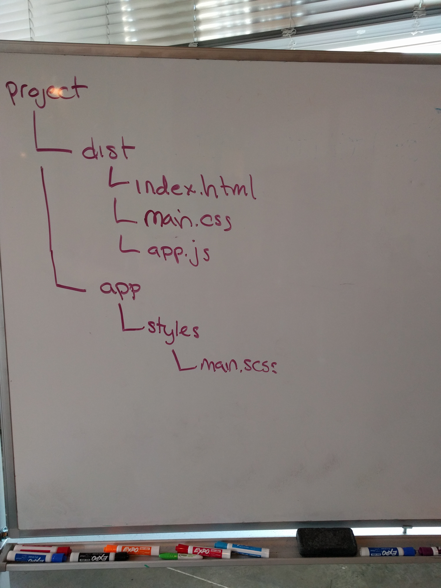

[Table of Contents](/README.md)

# Day 14 - SPAs, gh-pages, jQuery and the data attribute

## Review
- using classes to change behavior

## Challenge
Write a function letterCount() that takes a string and returns an object with the count of each letter that is in the string.

```js
letterCount("hello world");
// will return:
// {
//   h: 1,
//   e: 1,
//   l: 3,
//   o: 2,
//   w: 1,
//   r: 1,
//   d: 1
// }
```

## Notes
- new file structure:

- gh-pages
  - github will serve files in a gh-pages branch
  - `git subtree push --prefix dist origin gh-pages`
  - pattern for finding the site live
- SPAs
  - single page app - meaning that all our content lives on a single HTML page, which we manipulate to show different data and elements using javascript and css.
  - For safety, we wrap all of our DOM accessors and runtime code in a document ready block
  ```js
  // function declarations and variables that don't depend on DOM can go out here
  $(document).ready(function() {
    // write code here
  });
  ```
  - start with a good set of wireframes and/or a good description of what the app should do.
  - Build a mock up using only HTML and CSS, hard-coding in examples that will later be dynamically created with JS.
  - Think through the data structure needed for the application. Build out a mock of that data.
  - Now you're ready to start JavaScripting! Figure out what your user is going to do first, in an ideal world. Start there!!
    - This may mean adding an event listener for a click event
    - Or it may mean building a few elements that the user expects to see dynamically (rather than leaving them the hard coded versions in your mockup)
- data attribute
  - useful for keeping track of some unique information about an item in the DOM and how it relates to our JS data set.
  - any HTML attribute that is preceded by a `data-`. For example:
  ```html
  <ul>
    <li data-index="0">Some value</li>
    <li data-index="1">Some other value</li>
    <li data-index="2">value</li>
  </ul>
  <ul>
    <li class="message" data-id="7lsi3ls08l">A message with a unique id!</li>
    <li class="message" data-id="298laflk4w">A message with a unique id!</li>
    <li class="message" data-id="38ohlsflsk">A message with a unique id!</li>
    <li class="message" data-id="kjf7wrjdfl">A message with a unique id!</li>
    <li class="message" data-id="c98hlsnfoi">A message with a unique id!</li>
  </ul>
  ```
  - we set them either by hard coding them in HTML or with the `.attr()` method in jquery (see below)
  - we access them with the `.data()` method in jQuery
    - will return an object, where the keys of the object are the attribute name without the preceeding `data-`. From the example above: `{index: 0}` or `{id: '298laflk4w'}`
- `.attr()` jQuery method
  - used to access or change attributes in HTML elements.
  - get (access) an element's attribute by passing in one string argument, the name of the attribute.
  - set (change) an element's attribute by passing in 2 string arguments (name of attribute and attribute value)
  - or set multiple attributes at once by passing in an object of key (attribute name ) value (attribute value ) pairs.
  ```js
  var linkAddress = $('a').attr('href'); // returns the href of the first matching a tag
  $('a').attr('href', 'http://google.com'); // changes the href of all matching a tags to google.com
  $('li').attr({'data-index': 0, class: 'fancy-list-item'}); // adds or changes BOTH the data-index attribute and the class of all matching lis
  ```
## Resources
