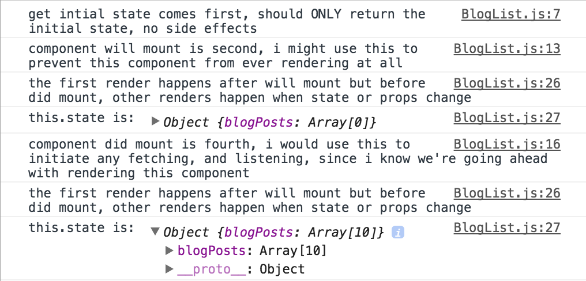

[Table of Contents](/README.md)

# Day 33 - React

## Review
Virtual/Shadow DOM
  - for speed
  - for keeping track of changes over time and repainting only what needs repainting

## Challenge

## Notes
- parameterized routes
  - set up just like in Backbone Router: use a `:` in your path in the `Route` component to denote the part that changes
  - React Router will automatically pass the value from the url into `this.props.params.parameterName`.
  - You can access the parameter there, and use it as you see fit!
- Navigating
  - links
    - React Router has a built in `Link` component that can be imported and used anywhere in the application
    - `Link` components work just like anchor tags. Instead of an `href` attribute they have a `to` attribute. The `to` should match the a known route of your application.
    - to navigate away from your application (like to google, for example) you should still use regular anchor tags
  - programmatic navigation
    - import the appropriate history (either `hashHistory` or `browserHistory`) from the react-router.
    - use the `.push()` method to navigate.
    - eg: `hashHistory.push('/posts/12345')`
- `this.props.children`
  - all components can be either self closing or utilize an opening and closing tag
  - if they are NOT self closing, anything placed between the opening and closing tags is passed into them as `this.props.children`
  - this is helpful for creating re-usable components whose contents might change in different circumstances (like a modal component, for example)
  - this is how the `Link` component is working behind the scenes. It has some functionality that it accomplishes (navigating), but the text it shows is just whatever you put inside it - aka `this.props.children`.
- nested routes
  - nested routes take advantage of `this.props.children`
  - A `Route` component can wrap around other child routes
  - This enables us to create base functionality for all routes, like every route having the same navigation on it
  - Just don't forget to put `{this.props.children}` in the parent route's component's render function, or its children will never know they should be rendered
- component lifecycle
  - important 'lifecycle' methods are exposed by React. We can use them to run code at certain times during the component lifecycle
  
- fetching data from the server
  - set up fetches and listeners in `componentDidMount`
  - set up unlisteners in `componentWillUnmount`
- state (for ajax purposes)
  - state is data that a component needs to properly display information to a user.
  - it differs from props in that it can change, and is NOT given to the component by a parent. The compenent itself is in charge of managing the state.
  - don't forget to set up initial state in `getInitialState`.
  - when we successfully get data from the server, we can then update our state to reflect the new data with `this.setState(stateObject)` where `stateObject` is an object of the state we are trying to update
- rendering lists of things
  - inside the render function, but before the return statement, you can create variables, run code, etc, but you should NEVER `setState` here.
  - React render functions are smart enough to render arrays!
  - Therefore we can map over and array of data in our render function (such as we have in props or state) and create a new array of JSX elements or React Components which we will actually render. 

## Resources
- [lifecycle methods](https://facebook.github.io/react/docs/component-specs.html)
